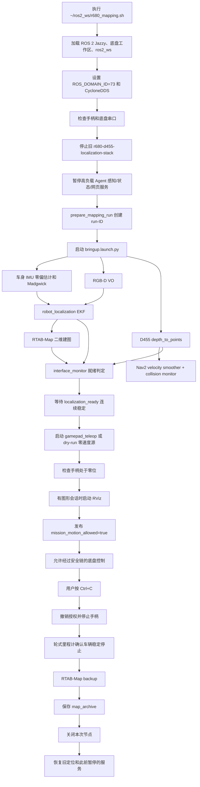
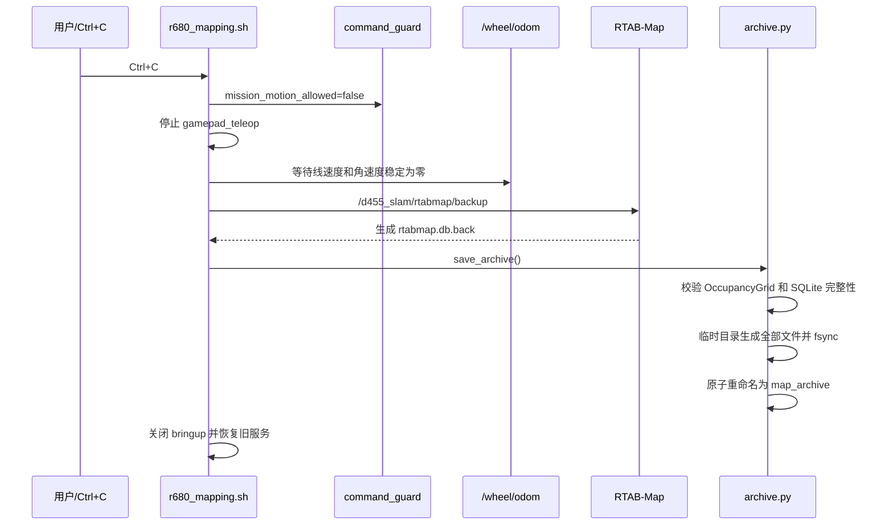
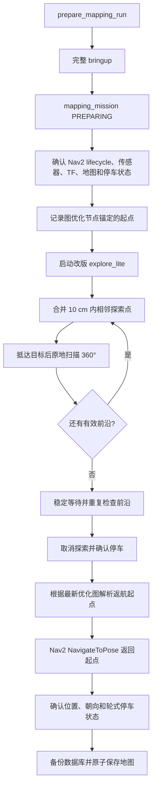

# R680 导航建图启动链路与代码目录树

本文档对应 Orin 上当前代码：

```text
/home/orin/ros2_ws
└── src/wla_r680_navigation    # 功能基线：c3d6754（文档提交前）
```

系统使用 ROS 2 Jazzy，默认 `ROS_DOMAIN_ID=73`。该包独立于 WLA Agent，负责 D455 RGB-D 定位、车身 IMU 融合、RTAB-Map 建图、Nav2 导航、安全速度链、手柄建图以及地图归档。

## 1. 一键手柄建图入口

```bash
cd ~/ros2_ws
./r680_mapping.sh
```

顶层脚本是源码脚本的软链接：

```text
~/ros2_ws/r680_mapping.sh
  -> ~/ros2_ws/src/wla_r680_navigation/scripts/r680_mapping.sh
```

仅验证传感器、定位、建图和安全链，不允许底盘运动：

```bash
cd ~/ros2_ws
./r680_mapping.sh --dry-run
```

建图结束时在运行脚本的终端按 `Ctrl+C`。脚本依次撤销运动授权、等待轮式里程计确认车辆停止、请求 RTAB-Map 备份、原子生成地图归档、关闭本次节点并恢复原定位服务。

## 2. 一键脚本的完整启动顺序



### 2.1 脚本启动前的检查

- 非 `--dry-run` 模式要求 `/dev/input/js0` 存在。
- 要求底盘串口 `/dev/serial/by-id/usb-WCH.CN_USB_Single_Serial_0002-if00` 存在。
- 停止旧的 `r680-d455-localization-stack.service`，避免两个 RTAB/VO 实例争用 `/d455_slam/*` 和 TF。
- D455 图像由只读输入服务继续提供，所以一键脚本使用 `start_d455:=false`。
- 暂停高负载 Agent 服务，减少 Orin CPU、内存和 DDS 压力。

### 2.2 一键脚本实际传给 bringup 的模式

```text
mode:=mapping
start_d455:=false
start_chassis:=true
start_nav2:=true
start_navigation_servers:=false
start_state_estimation:=true
use_d455_imu:=false
use_chassis_imu:=true
publish_mount_tf:=true
enable_hardware_output:=true       # --dry-run 时为 false
```

`start_navigation_servers=false` 表示手动建图时只启动速度平滑器和碰撞监控，不启动 planner、controller、BT navigator 等自动导航服务，从而减少资源占用和遥控卡顿。

## 3. 传感器、定位和 TF 链

```mermaid
flowchart LR
    RGB[D455 RGB\n/r680/d455/color/image_raw] --> VO[rtabmap rgbd_odometry]
    DEPTH[D455 对齐深度\n/r680/d455/aligned_depth_to_color/image_raw] --> VO
    INFO[CameraInfo] --> VO
    VO --> VOODOM[/r680_nav/vo_odom]

    CIME[/wheel/imu/data_raw] --> COND[imu_conditioner\n静止零偏估计]
    COND --> MAD[Madgwick]
    MAD --> FIMU[/r680_nav/chassis/imu_filtered]

    VOODOM --> EKF[robot_localization EKF]
    FIMU --> EKF
    EKF --> FODOM[/d455_slam/odom]

    RGB --> RTAB[RTAB-Map]
    DEPTH --> RTAB
    FODOM --> RTAB
    FIMU --> RTAB
    RTAB --> MAP[/r680/d455/map]
    RTAB --> MAPTF[map -> d455_floor_odom]
```

当前坐标链：

```text
map
└── d455_floor_odom                  # RTAB-Map 发布全局校正
    └── r680_mapping_floor           # EKF 发布融合后的车体位姿
        ├── d455_link                # 实测 D455 安装外参
        │   └── D455 optical frames  # RealSense 驱动发布
        └── gyro_link                # 当前车身 IMU 假定在车体中心且轴对齐
```

### 3.1 VO 与 VIO 的职责

- `rgbd_odometry` 使用 RGB、对齐深度和相机内参输出六自由度 RGB-D VO。
- `imu_conditioner` 在启动静止阶段估计三轴陀螺零偏，并补充协方差。
- Madgwick 根据车身 IMU 输出姿态。
- `robot_localization` EKF 联合 VO 与车身 IMU，输出 `/d455_slam/odom`。
- D455 自带 IMU 目前因 HID 枚举问题保持关闭，`use_d455_imu=false`。
- 底盘轮式里程计当前用于停车确认，没有融合进主定位。

## 4. 深度障碍和控制链

```mermaid
flowchart LR
    D[D455 aligned depth] --> P[C++ depth_to_points]
    P --> PC[/r680_nav/d455/points]
    PC --> LC[Nav2 local costmap obstacle layer]
    PC --> CM[Nav2 collision_monitor]

    GP[手柄 gamepad_teleop] --> CMD[/cmd_vel_nav]
    NAV[Nav2 controller / behavior] --> CMD
    CMD --> VS[velocity_smoother]
    VS --> SM[/cmd_vel_smoothed]
    SM --> CM
    CM --> CHECK[/r680_nav/cmd_vel_collision_checked]
    CHECK --> GUARD[C++ command_guard]
    READY[/r680_nav/localization_ready] --> GUARD
    PERM[/r680_nav/mission_motion_allowed] --> GUARD
    GUARD --> PREVIEW[/r680_nav/cmd_vel_safe_preview]
    GUARD --> RAW[/r680_nav/chassis_cmd_vel]
    RAW --> DRIVER[wheeltec_robot_node]
    DRIVER --> STM32[STM32 底盘]
```

`command_guard` 是最终硬件门禁，只有以下条件同时满足才转发非零速度：

- 定位、RGB、Depth、CameraInfo 和障碍点云持续新鲜；
- 任务运动授权持续新鲜且为 `true`；
- 上游速度命令没有超时；
- 数值有限并经过前进、倒车和角速度限幅；
- `enable_hardware_output=true`。

当前限速：

```text
前进：0.30 m/s
倒车：0.08 m/s
角速度：0.50 rad/s
命令超时：0.30 s
健康状态超时：0.50 s
```

## 5. RTAB-Map 当前二维地图参数

`bringup.launch.py` 当前显式加载：

```text
Grid/Sensor                       1       # RGB-D 深度
Grid/3D                           false   # 直接生成二维栅格
Grid/RayTracing                   true    # 射线清理自由空间
Grid/RangeMin                     0.25 m
Grid/RangeMax                     4.0 m
Grid/NoiseFilteringRadius         0.10 m
Grid/NoiseFilteringMinNeighbors   5
GridGlobal/Eroded                 true
Grid/NormalsSegmentation          false   # 当前使用高度直通过滤
Grid/MinGroundHeight             -0.08 m
Grid/MaxGroundHeight              0.04 m
Rtabmap/DetectionRate             1.0 Hz
```

这里的高度已经通过 TF 转换到 `r680_mapping_floor`，地面约为 `z=0`，不是相对于相机光学坐标。

当前尚未接入 YOLO 人体掩膜深度过滤。因此操作者持续出现在 D455 视野内时，人体仍可能被 RTAB-Map 写入静态地图。Nav2 实时动态障碍层使用原始深度点云，这一职责应与未来的“过滤人物后静态建图深度”分开。

## 6. 手动建图结束和地图保存链



## 7. 自主探索启动链

自主探索沿用仿真逻辑，但需要把 `start_navigation_servers` 设为 `true`，使完整 Nav2 服务启动：

```text
planner_server
controller_server
smoother_server
behavior_server
bt_navigator
waypoint_follower
velocity_smoother
collision_monitor
```

任务流程：



提前结束探索并进入返航：

```bash
ros2 service call /r680_nav/finish_exploration std_srvs/srv/Trigger '{}'
```

取消整个任务：

```bash
ros2 service call /r680_nav/cancel_mapping std_srvs/srv/Trigger '{}'
```

目前只有手动建图的一键脚本。自主探索已经有任务编排代码，但还没有独立的 `r680_auto_mapping.sh` 一键入口。

## 8. ROS 2 工作区目录树

```text
/home/orin/ros2_ws/
├── r680_mapping.sh                         # 一键手柄建图入口，软链接到源码脚本
├── src/
│   ├── wla_r680_navigation/                # R680 独立导航、建图和安全控制包
│   │   ├── package.xml                     # ROS 依赖和包元数据
│   │   ├── CMakeLists.txt                  # C++、Python、配置和启动文件安装规则
│   │   ├── README.md                       # 使用说明和接口摘要
│   │   ├── config/
│   │   │   ├── chassis.yaml                # 串口、波特率、底盘/轮式里程计/IMU frame
│   │   │   ├── ekf_vo_imu.yaml             # robot_localization：VO + 三轴 IMU 融合
│   │   │   ├── exploration.yaml            # 前沿探索、到点扫描、恢复和目标合并参数
│   │   │   ├── interfaces.yaml             # 输入、感知、定位、地图和运动话题契约
│   │   │   ├── mission.yaml                # 启动/探索/返航/保存超时和到达判据
│   │   │   ├── nav2.yaml                   # MPPI、Smac、costmap、平滑和碰撞监控
│   │   │   ├── r680_mapping.rviz           # 手动建图 RViz 显示布局
│   │   │   └── rtabmap.yaml                # RGB-D VO 和 D455 IMU 滤波参数
│   │   ├── launch/
│   │   │   └── bringup.launch.py           # 全链统一启动与模式开关
│   │   ├── scripts/
│   │   │   ├── r680_mapping.sh             # 一键手柄建图、自动保存与服务恢复
│   │   │   ├── prepare_mapping_run         # 创建独立 run-ID 并快照本次配置
│   │   │   ├── save_manual_map             # 停车验证、RTAB 备份、手动地图归档
│   │   │   └── mapping_mission              # 自主探索任务 Python 入口
│   │   ├── src/
│   │   │   ├── depth_to_points.cpp         # 对齐深度转轻量 XYZ PointCloud2
│   │   │   ├── imu_conditioner.cpp          # 车身 IMU 静止零偏和协方差处理
│   │   │   ├── interface_monitor.cpp        # 传感器/里程计/点云新鲜度聚合
│   │   │   └── command_guard.cpp            # 最终速度超时、健康、授权和限幅门禁
│   │   └── wla_r680_navigation_py/
│   │       ├── __init__.py
│   │       ├── mission.py                   # 探索→返航→停车→保存主状态机
│   │       ├── mission_core.py              # 前沿复核、到达判定、图锚定起点纯逻辑
│   │       └── archive.py                   # 原子地图归档、数据库校验和 SHA-256
│   ├── gamepad_contorl/                     # 原仓库目录名保留了 contorl 拼写
│   │   ├── gamepad_control/                 # 手柄 ROS 2 Python 节点
│   │   ├── config/                          # 手柄轴、按键、速度和滤波参数
│   │   ├── launch/                          # 手柄启动文件
│   │   ├── start.sh                         # 原手柄启动入口
│   │   ├── setup.py / setup.cfg
│   │   └── package.xml
│   ├── explore/                             # 改版 explore_lite
│   │   ├── include/                         # 前沿、standoff、恢复等 C++ 声明
│   │   ├── src/                             # 探索节点和前沿搜索实现
│   │   ├── config/                          # explore_lite 示例参数
│   │   ├── launch/                          # explore_lite 独立启动文件
│   │   ├── test/                            # 探索回归测试
│   │   ├── CMakeLists.txt
│   │   └── package.xml
│   └── explore_lite_msgs/
│       ├── msg/                             # ExploreStatus 等探索状态消息
│       ├── CMakeLists.txt
│       └── package.xml
├── build/                                   # colcon 中间构建产物，不提交 Git
├── install/                                 # colcon 安装空间，不提交 Git
├── log/                                     # colcon 日志，不提交 Git
├── test_data/                               # 早期 RTAB-Map 烟雾测试数据库
├── test_logs/                               # 早期整链测试日志
└── test_runs/                               # 早期任务归档测试目录
```

## 9. 单次建图运行目录

默认保存根目录：

```text
/home/orin/.local/share/wla/r680-navigation/runs/
└── run-YYYYMMDD-HHMMSS/
    ├── run.json                         # run-ID、数据库路径、IMU 模式、硬件输出状态
    ├── nav2.yaml                        # 本次 Nav2 参数快照
    ├── exploration.yaml                 # 本次探索参数快照
    ├── mission.yaml                     # 本次任务参数快照
    ├── interfaces.yaml                  # 本次接口契约快照
    ├── rtabmap.yaml                     # 本次 VO/IMU 参数快照
    ├── ekf_vo_imu.yaml                  # 本次 EKF 参数快照
    ├── chassis.yaml                     # 本次底盘参数快照
    ├── rtabmap.db                       # 正在运行的 RTAB-Map 数据库
    ├── rtabmap.db.back                  # backup 服务生成的闭合备份
    ├── manual_mapping_result.json        # 手动建图结果
    ├── exploration.json                 # 自主任务状态、历史和退出原因
    ├── logs/
    │   ├── bringup.log                  # 定位、建图、Nav2、安全链和底盘日志
    │   ├── gamepad.log                  # 手柄或 dry-run 零速度源日志
    │   ├── motion_permission.log         # 运动授权发布日志
    │   └── rviz.log                     # RViz 日志
    └── map_archive/                     # 停车、备份和校验完成后原子生成
        ├── map.pgm                      # 标准 ROS 二维栅格图
        ├── map.yaml                     # map_server 可加载的地图描述
        ├── occupancy_grid.json          # 完整 OccupancyGrid，保留未知格和概率值
        ├── rtabmap.db                   # 完整性检查通过的闭合数据库
        ├── resolved_params.yaml         # 本次实际配置汇总
        ├── mission_result.json          # 手动/自主任务结果
        └── manifest.json                # 文件 SHA-256、frame 和任务元数据
```

## 10. `bringup.launch.py` 主要开关

| 参数 | 默认值 | 作用 |
|---|---:|---|
| `mode` | `mapping` | `mapping` 新建图；`localization` 加载已有数据库定位 |
| `start_d455` | `false` | 是否由本包启动 RealSense；当前通常复用只读输入服务 |
| `start_chassis` | `false` | 是否启动候选 Wheeltec 串口底盘节点 |
| `start_nav2` | `true` | 是否启动 Nav2 安全链或完整导航链 |
| `start_navigation_servers` | `true` | `false` 只启动平滑和碰撞监控；`true` 启动完整 Nav2 |
| `start_state_estimation` | `true` | 是否启动 VO、EKF 和 RTAB-Map |
| `use_d455_imu` | `false` | D455 HID 修复和标定前保持关闭 |
| `use_chassis_imu` | `false` | 是否融合车身三轴 IMU；一键建图脚本设为 `true` |
| `enable_hardware_output` | `false` | 是否允许 command_guard 发布到底盘原始入口 |
| `publish_mount_tf` | `false` | 是否发布车体到 D455 的实测静态外参 |
| `database_path` | 用户数据目录 | RTAB-Map 数据库路径 |

## 11. 常用运行检查

```bash
source /opt/ros/jazzy/setup.bash
source ~/r680_chassis_candidate_ws/install/setup.bash
source ~/ros2_ws/install/setup.bash
export ROS_DOMAIN_ID=73

ros2 topic hz /r680_nav/vo_odom
ros2 topic hz /d455_slam/odom
ros2 topic hz /r680_nav/d455/points
ros2 topic echo /r680_nav/localization_ready --once
ros2 topic echo /r680_nav/cmd_vel_safe_preview
ros2 param get /r680_command_guard hardware_output_enabled
ros2 lifecycle get /collision_monitor
```

查看最近一次手动建图目录：

```bash
cat /tmp/wla_manual_mapping_run
```

查看当前一键脚本日志：

```bash
RUN_DIR=$(cat /tmp/wla_manual_mapping_run)
tail -f "$RUN_DIR/logs/bringup.log"
```

## 12. 当前边界和后续接口

- 当前静态建图没有人体语义深度过滤，操作者可能进入静态地图。
- D455 自带 IMU 尚未可用，当前一键流程融合车身 IMU。
- 轮式里程计尚未作为 EKF 观测输入，只用于停车确认。
- 人物等动态障碍应从静态 RTAB 深度输入中过滤，但仍保留在 Nav2 原始深度动态层中。
- 自动探索已有核心任务代码和改版 `explore_lite`，仍需补充实车一键入口和有人值守验收。
- 真实底盘控制必须经过 `velocity_smoother → collision_monitor → command_guard`，不要直接向底盘驱动的原始 `cmd_vel` 发布。
